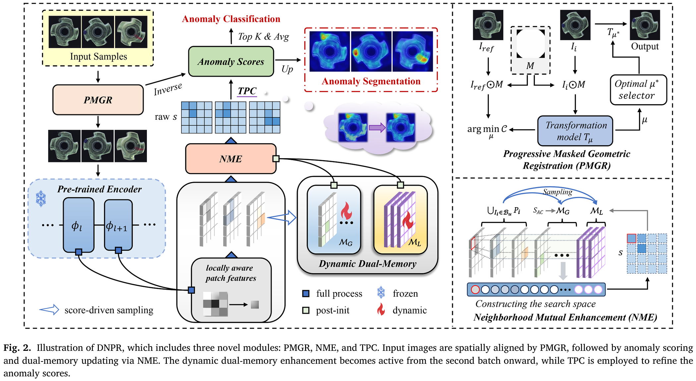
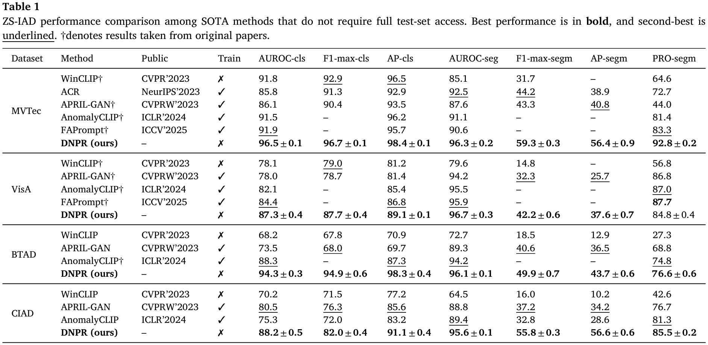

# DNPR: Zero-Shot Industrial Anomaly Detection via Dynamic Normal Prototype Refinement

[](https://www.python.org/downloads/)
[](https://pytorch.org/)
[](https://opensource.org/licenses/MIT)

Official implementation of **DNPR** (Dynamic Normal Prototype Refinement) for zero-shot industrial anomaly detection.

## 🔥 Highlights

- **Zero-shot anomaly detection**: No training on target dataset required
- **Dynamic prototype evolution**: Adaptive normal pattern learning during inference
- **Multi-dataset support**: MVTec-AD, VisA, BTAD, DTD-Synthetic, CableInspect-AD, RAD
- **High performance**: State-of-the-art results on multiple benchmarks

<p align="center">
  
</p>

## 📦 Installation

### Prerequisites

- Python 3.9 - 3.11
- CUDA 11.8+ (for GPU support)

### Using uv (Recommended)

```bash
# Install uv if not already installed
curl -LsSf https://astral.sh/uv/install.sh | sh

# Clone the repository
git clone https://github.com/yourusername/DNPR.git
cd DNPR

# Create virtual environment and install dependencies
uv venv
source .venv/bin/activate  # On Windows: .venv\Scripts\activate
uv pip install -e .
```

### Using pip

```bash
git clone https://github.com/yourusername/DNPR.git
cd DNPR
pip install -e .
```

## 📁 Project Structure

```
DNPR/
├── src/
│   └── dnpr/
│       ├── __init__.py
│       ├── main.py              # Entry point
│       ├── models/
│       │   ├── __init__.py
│       │   ├── dnpr.py          # Main DNPR model
│       │   ├── backbones.py     # Backbone networks
│       │   └── common.py        # Common modules
│       ├── datasets/
│       │   ├── __init__.py
│       │   ├── base.py          # Base dataset class
│       │   ├── mvtec.py         # MVTec-AD dataset
│       │   ├── visa.py          # VisA dataset
│       │   └── transforms.py    # Data transforms
│       └── utils/
│           ├── __init__.py
│           ├── metrics.py       # Evaluation metrics
│           ├── visualization.py # Plotting utilities
│           └── helpers.py       # Helper functions
├── configs/
│   ├── mvtec.yaml
│   ├── visa.yaml
│   ├── btad.yaml
│   └── ...
├── scripts/
│   ├── run.sh
│   ├── fast_run.sh
│   └── prepare_data/
│       ├── prepare_btad.py
│       ├── prepare_visa.py
│       └── ...
├── tests/
│   └── ...
├── pyproject.toml
├── README.md
├── LICENSE
└── .gitignore
```

## 📊 Dataset Preparation

### MVTec-AD

1. Download from [MVTec-AD](https://www.mvtec.com/company/research/datasets/mvtec-ad)
2. Extract to `data/mvtec_anomaly_detection/`

### VisA

1. Download from [VisA](https://amazon-visual-anomaly.s3.us-west-2.amazonaws.com/VisA_20220922.tar)
2. Extract to `data/VisA_20220922/`

### BTAD

1. Download from [BTAD](http://avires.dimi.uniud.it/papers/btad/btad.zip)
2. Extract and run preprocessing:
   ```bash
   python scripts/prepare_data/prepare_btad.py --data_path /path/to/btad
   ```

<details>
<summary>Other Datasets</summary>

### CableInspect-AD
1. Download from [CableInspect-AD](https://mila-iqia.github.io/cableinspect-ad/)
2. Extract and run preprocessing:
   ```bash
   python scripts/prepare_data/cableinspect_ad_csv.py --data_path /path/to/cableinspect_ad
   ```

### DTD-Synthetic
1. Download from [DTD-Synthetic](https://drive.google.com/drive/folders/10OyPzvI3H6llCZBxKxFlKWt1Pw1tkMK1)
2. Extract and run preprocessing:
   ```bash
   python scripts/prepare_data/dtd_synthetic_csv.py --data_path /path/to/dtd_synthetic
   ```

### RAD
1. Download from [RAD](https://github.com/hustCYQ/RAD-dataset)
2. Extract and run preprocessing:
   ```bash
   python scripts/prepare_data/rad_csv.py --data_path /path/to/rad
   ```

</details>

## 🚀 Quick Start

### Single Dataset Evaluation

```bash
# MVTec-AD (0-shot)
python -m dnpr.main \
    --config configs/mvtec.yaml \
    --gpu 0 \
    --k_shot 0 \
    --seed 0

# VisA (0-shot)
python -m dnpr.main \
    --config configs/visa.yaml \
    --gpu 0 \
    --k_shot 0 \
    --seed 0
```

### Few-Shot Evaluation

```bash
# 1-shot on MVTec-AD
python -m dnpr.main \
    --config configs/mvtec.yaml \
    --gpu 0 \
    --k_shot 1 \
    --seed 0
```

### Run Multiple Seeds

```bash
# Using the provided script
bash scripts/fast_run.sh 16 output
```

## ⚙️ Configuration

Key configuration parameters in YAML files:

| Parameter | Description | Default |
|-----------|-------------|---------|
| `input_size` | Input image size | [336, 336] |
| `crop_size` | Crop size | [336, 336] |
| `batch_size` | Batch size | 16 |
| `backbone` | Feature extractor | wideresnet50 |
| `layers_to_extract_from` | Feature layers | [layer2, layer3] |
| `glo_memory_num` | Global memory size | 12 |
| `loc_memory_num` | Local memory size | 3 |
| `nbr` | Neighborhood size | 9 |

## 📈 Results

### Zero-Shot Performance (%)

| Dataset | image-AUROC | pixel-AUROC | PRO |
|---------|---------|---------|-----|
| MVTec-AD | 96.5 | 96.3 | 92.8 |
| VisA | 87.3 | 96.3 | 84.8 |
| BTAD | 94.3 | 96.7 | 76.6 |
| CableInspect-AD | 88.2 | 95.6 | 85.5 |
| DTD-Synthetic | 92.9 | 97.5 | 92.0 |
| RAD | 95.3 | 95.1 | 85.7 |

*Results may vary slightly depending on hardware and random seeds.*

### Qualitative comparison (%)

<p align="center">
  
</p>

## 🔧 Advanced Usage

### Custom Dataset

1. Create a CSV file with columns: `object, split, label, image, mask`
2. Create a config YAML:
   ```yaml
   dataset:
     type: custom
     image_reader:
       type: opencv
       kwargs:
         image_dir: /path/to/images
         color_mode: RGB
     train:
       meta_file: /path/to/train.csv
     test:
       meta_file: /path/to/test.csv
     input_size: [336, 336]
     crop_size: [336, 336]
   ```

### Using Different Backbones

```bash
python -m dnpr.main \
    --config configs/mvtec.yaml \
    --backbone resnet50
```

Available backbones: `resnet50`, `resnet101`, `wideresnet50`, `wideresnet101`, `efficientnet_b5`, etc.

## 📝 Citation

If you find this work useful, please consider citing:

```bibtex
@article{li2026dnpr,
  title={DNPR: Zero-shot industrial anomaly detection via dynamic normal prototype refinement},
  author={Li, Shuyun and Li, Zhi and Wang, Weidong and Zheng, Long and Lu, Yu},
  journal={Expert Systems with Applications},
  pages={131331},
  year={2026},
  publisher={Elsevier}
}
```

## 📄 License

This project is licensed under the MIT License - see the [LICENSE](LICENSE) file for details.

## 🙏 Acknowledgements

- [timm](https://github.com/huggingface/pytorch-image-models) for pretrained models
- [PatchCore](https://github.com/amazon-science/patchcore-inspection) for inspiration

## 📧 Contact

For questions or issues, please open a GitHub issue or contact [tlm2640@163.com](mailto:tlm2640@163.com).
